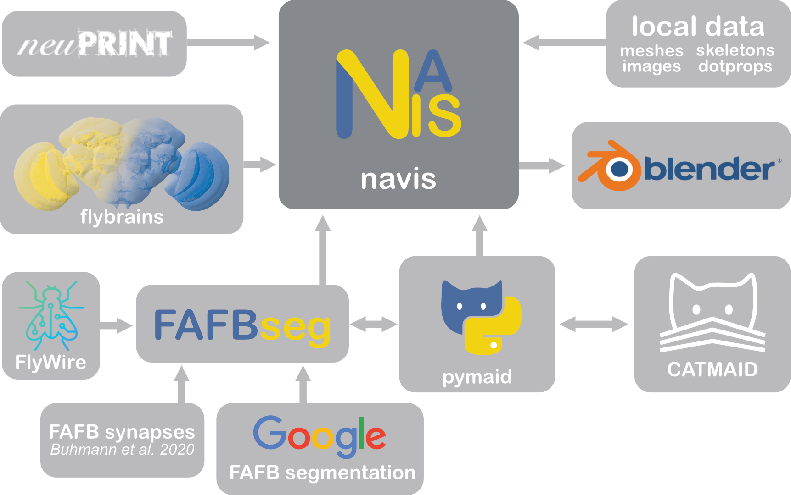

# {{ navis }} & friends

{{ navis }} comes with batteries included but is also highly extensible. Here are
some libraries that are built directly on top of {{ navis }}.

## flybrains

[flybrains](https://github.com/navis-org/navis-flybrains) is a package that
bundles fly template brains and transforms that {{ navis }} can use to map spatial
data (e.g. neurons) from one brain space to another. If you installed {{ navis }}
via ``pip`` with the ``[flybrains]`` option, you should already have this package.

## pymaid

[pymaid](https://pymaid.readthedocs.io/en/latest/) provides an interface with
[CATMAID](https://catmaid.readthedocs.io/en/stable/) servers. It allows
you to pull data (neurons, connectivity) that can be directly plugged into
{{ navis }}. Conversely, you can also take {{ navis }} neurons and push them to a
CATMAID server. ``pymaid`` is a great example of how to extend {{ navis }}.

## fafbseg

[fafbseg](https://fafbseg-py.readthedocs.io/en/latest/index.html) contains
tools to work with autosegmented data for the
[FAFB](https://www.temca2data.org) (full adult fly brain)
EM dataset. It brings together data from [FlyWire](https://flywire.ai/),
[Google's](http://fafb-ffn1.storage.googleapis.com/landing.html) segmentation
of FAFB and [synapse predictions](https://github.com/funkelab/synful) by
Buhmann et al. (2019).

## natverse

The [natverse](http://natverse.org/) is {{ navis }}'s equivalent in R. While we
are aiming for feature parity, it can be useful to access ``natverse`` functions
from Python. For this, {{ navis }} offers some convenience functions using the
R-Python interface ``rpy2``. Check out the [tutorial](generated/gallery/).
